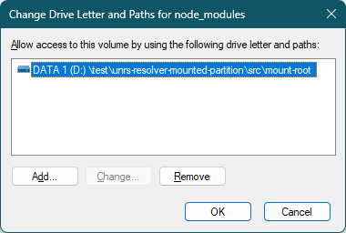
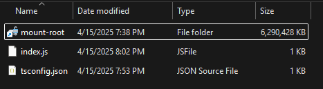

# unrs-resolver-mounted-partition

This repo demonstrates the issue that the path resolved from `unrs-resolver` can contain unexpected segments
if the target module is inside a ["Mounted Volume"](https://learn.microsoft.com/en-us/windows-server/storage/disk-management/assign-a-mount-point-folder-path-to-a-drive).

## Prerequsite

* Windows with NTFS support (basically, Windows XP)
* Node 20+
* Yarn (`npm install yarn`)
* A partition formatted with NTFS

## Preparation

1. Clone or download the repo into an NTFS partition.
2. Create an empty folder at the path "./src/mount-root".
3. [Mount a Volume under this empty folder](https://learn.microsoft.com/en-us/windows-server/storage/disk-management/assign-a-mount-point-folder-path-to-a-drive)
with Disk Management. I have not tested yet but you might need to make sure there is no drive letter assigned to the same Volume.
    
    
4. Create an empty file at the path "./src/mount-root/foo.ts", so it is actually created inside the mounted Volume.
5. In the repo root, run the following command to restore the whole workspace
    ```powershell
    PS > yarn install
    ```

## Reproduction

In the `src` folder, run the following command to reproduce

```powershell
PS \unrs-resolver-mounted-partition\src> node index.js
```

Actual output was
```js
{
  path: '...\\unrs-resolver-mounted-partition\\src\\Volume{<G-U-I-D>}\\foo.ts',
  moduleType: 'module',
  packageJsonPath: '...\\unrs-resolver-mounted-partition\\package.json'
}
```

While `unrs-resolver` can locate the `foo.ts` you've just created, the `Volume{<G-U-I-D>}` part is incorrect.
There is no actual folder named `"Volume{<G-U-I-D>}"` under `src`.
Instead, we expect something like
```js
{
  path: '...\\unrs-resolver-mounted-partition\\src\\mount-root\\foo.ts',
  moduleType: 'module',
  packageJsonPath: '...\\unrs-resolver-mounted-partition\\package.json'
}
```
